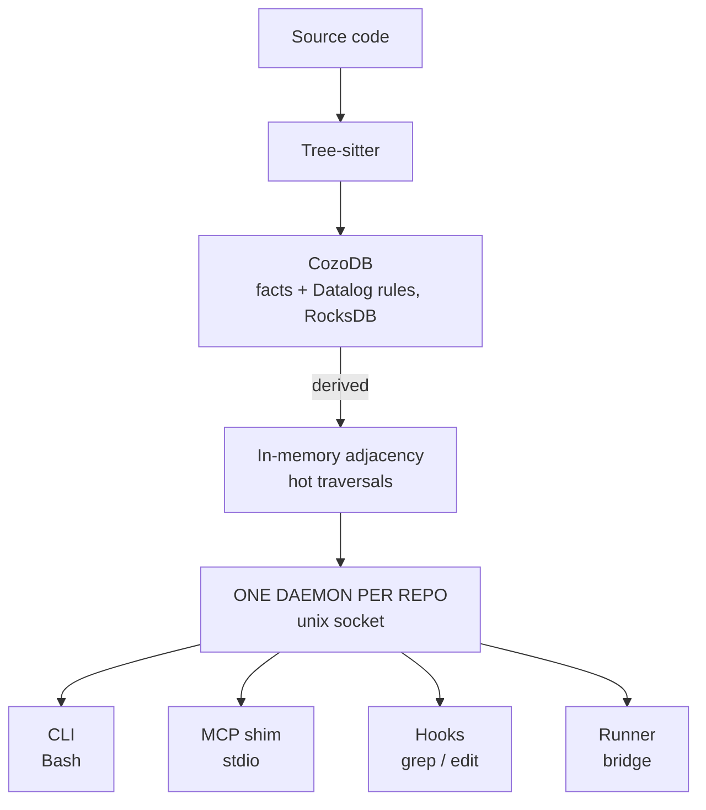

# Graphite

Embedded code-graph engine for AI code assistants. One Rust daemon per repo extracts dependency graphs via Tree-sitter, persists them in CozoDB (embedded Datalog), and serves surgical context so the agent acts instead of exploring.

**The graph that makes your agent finish faster.**

## Why

AI agents spend most of their time reading files to understand architecture before acting. Graphite eliminates that exploration phase:

- **Blast radius in one call.** Change a function, see everything that transitively depends on it, with source code inline and covering tests. No follow-up reads.
- **Always-hot graph.** A per-repo daemon indexes eagerly on file save. Queries hit an already-indexed graph through a local socket. No rebuild in the query path.
- **Edge confidence.** Every edge tagged EXTRACTED, INFERRED or AMBIGUOUS with provenance. The agent knows when to trust the graph and when to verify.
- **Transparent interception.** PreToolUse hooks rewrite the agent's `grep`/`find`/`cat` into enriched graph-aware answers. The agent gets structural context without changing its habits.

## Architecture



**Hybrid engine** (decided after measured benchmark):
- CozoDB (`mnestic` fork, RocksDB) holds facts, derives confidence by rule, handles search
- In-memory adjacency serves traversals: 19–80 µs on worst real hubs vs 3–13 ms through DB
- Background crate runs community detection and PageRank off the query path

## Current State

**v1.0 in progress** (thesis slice). What exists:

| Component | Status |
|-----------|--------|
| Python extractor (Tree-sitter) | Implemented |
| CozoDB store + in-memory adjacency | Implemented |
| Daemon (watcher, freshness barrier, socket server) | Implemented |
| CLI (`init`, `lookup`, `blast`, `diff-impact`, `hooks`) | Implemented |
| Enriched grep + interception hooks (`graphite-hook`) | Implemented |
| Effectiveness bench (pilots A, B, C, C2 run) | Active |
| Rust / TypeScript extractors | v1.1 |
| MCP shim, runner integration | v1.1–v1.2 |

~17,800 lines of Rust across 7 crates. Clippy clean, two binaries (`graphite`, `graphite-hook`).

### Bench Results (pilots on real multi-language repo tasks)

- **Pilot A** (no Graphite): baseline
- **Pilot B** (CLI + prompt line): turns ratio 1.05, wall-clock 0.88, but agent often didn't use Graphite or grepped after a complete answer
- **Pilot C** (interception hooks + enriched grep): closes the adoption gap, hooks deliver answers where the agent already is
- **Pilot C2** (issue-form tasks, no file or function named; default answer budget, more shell shapes intercepted): turns ratio 0.83, wall-clock 0.86 against a fresh baseline. Files read 6.5 to 3.0. One failure in 10 runs, where the agent never ran the test suite; zero failures caused by a Graphite answer

Full analysis in [`bench/effectiveness/`](bench/effectiveness/).

For a detailed comparison with other code-graph tools (Graphify, CodeGraph, Graft, GitNexus, codebase-memory), see the [Landscape](https://tiphareth.com.br/graphite/docs/landscape/).

## Quick Start

```bash
cargo build --release

# Start the daemon for the current repo and index it
./target/release/graphite init

# Blast radius of a symbol
./target/release/graphite blast my_function

# Impact of current diff
./target/release/graphite diff-impact

# Install interception hooks (Claude Code; needs graphite-hook on PATH)
./target/release/graphite hooks install
```

## Project Structure

```
crates/
  cli/            CLI entry point
  daemon/         Per-repo daemon (watcher, socket, freshness, queries)
  extract-python/ Python Tree-sitter extractor
  hooks/          graphite-hook: PreToolUse/PostToolUse interception
  model/          Symbol, Edge, SymbolKind, Confidence types
  query/          blast, diff, lookup, traverse, compress, envelope
  store/          CozoDB store + adjacency
bench/            Storage, effectiveness and interception-replay benchmarks
site/             Landing page and public documentation
```

## Optimization Targets

These three are the only absolutes. Everything else is derived and revisable.

1. **Agent execution speed.** Total wall-clock time the agent takes to finish a task. Not query latency.
2. **Assertiveness.** The agent acts with confidence because it has context upfront. No hesitation, no backtracking.
3. **Correctness.** Blast radius visible, dynamic dispatch mapped, nothing silently missed.

## Tech Stack

| Component | Technology |
|-----------|------------|
| Language | Rust |
| AST parsing | Tree-sitter (compiled in) |
| Graph storage | CozoDB via `mnestic` fork (RocksDB) + in-memory adjacency |
| Daemon IPC | Unix socket |
| Content hashing | BLAKE3 |
| CLI | clap |
| Serialization | serde + serde_json |
